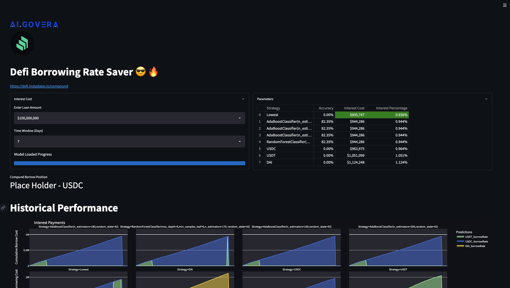

# DeepDefiApp - Pre Alpha



This web app is used to compare models for DeFi borrowing interest prediction

Clone Repository

```
git clone https://github.com/VintageGold/DeepDefiApp.git
```


Install create conda environment and packages.

```
conda create -n DeepDefiApp -c conda-forge pip 

conda activate DeepDefiApp

cd DeepDefiApp

pip install -r requirements.txt
```

Run streamlit app

```
cd app
streamlit run app.py
```

Disclaimer: These models are currently enduring testing, use the insight at your own risk.

